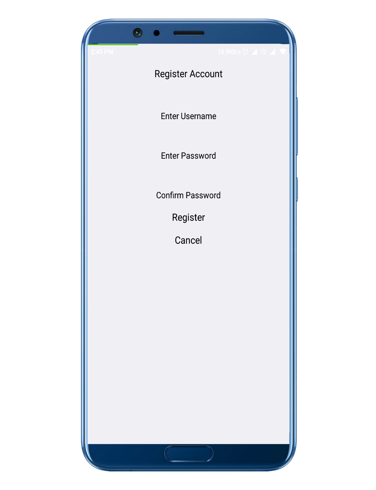
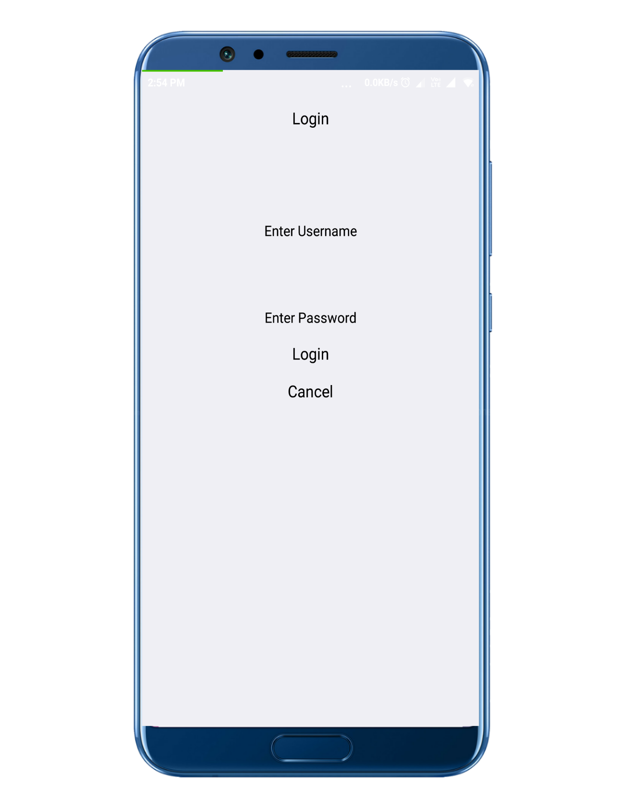
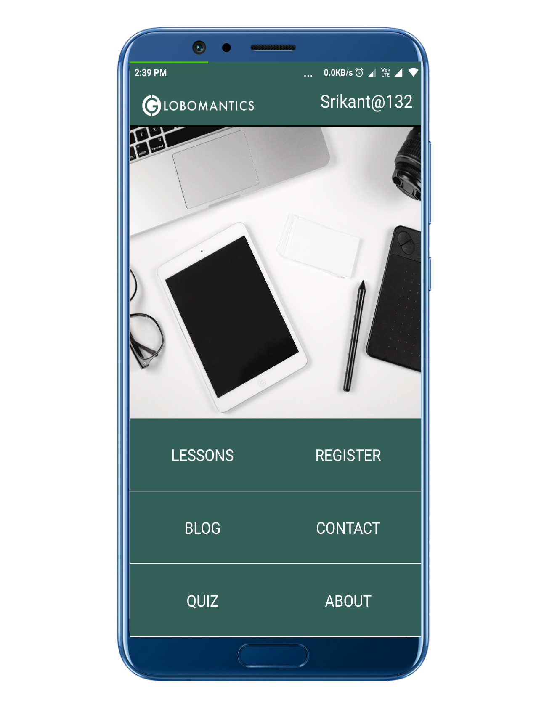
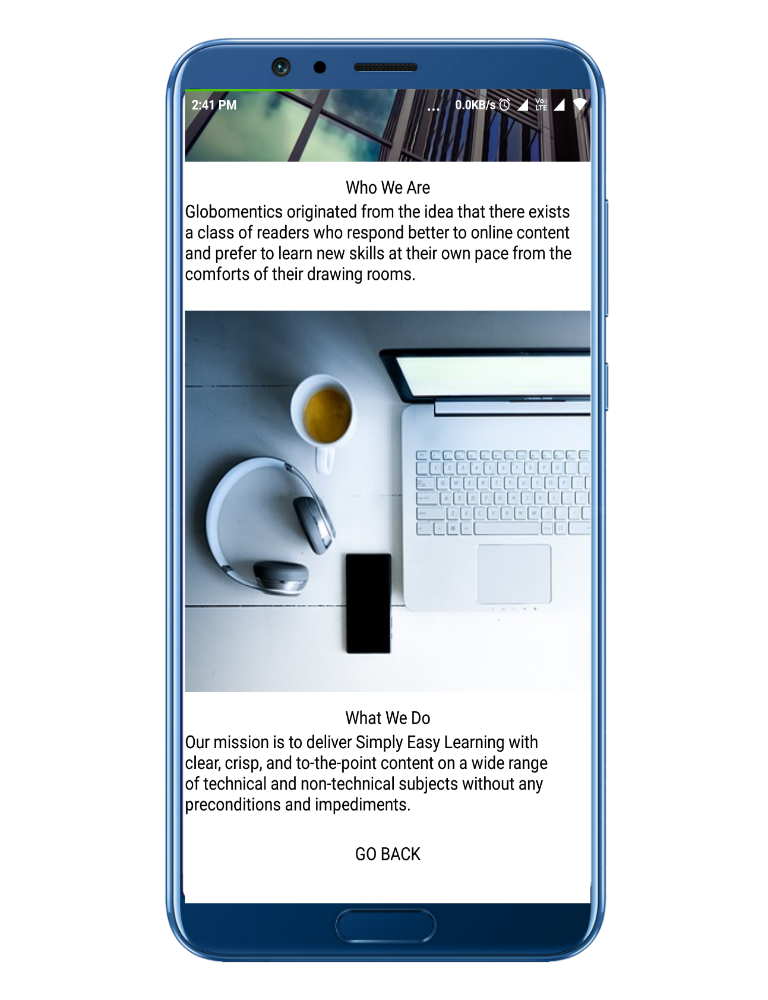

# Globo
This is a react native mobile app that allowed us to  get access to a learning feature that includes 1.Technical Blog 2.Quiz 3.Video Lectures
<h2> splah screen and Menu page </h2>

  

  

<h2> Register screen and Login page </h2>

  

  

<h2> Logged In screen and  About page </h2>

  

  

